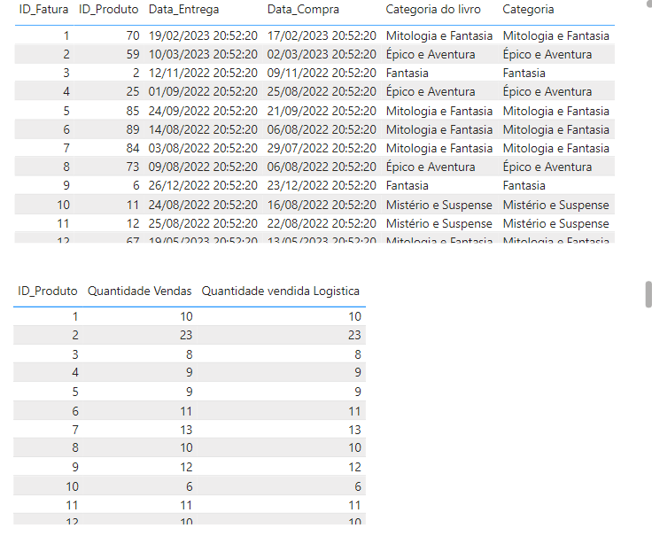
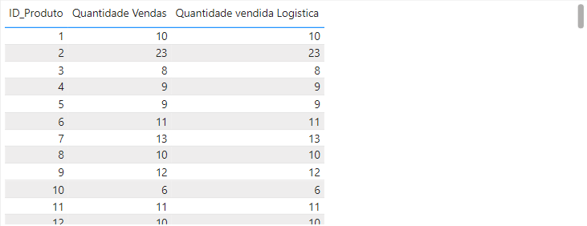
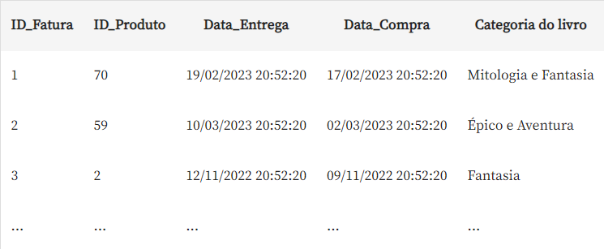

## Projeto feito por Leandro Launé

## Project Made by Leandro Launé

# Descrição do Projeto

# Project Description

**Portuguese Version:**

Neste projeto de Power BI, realizou-se uma análise do e-commerce de livros Buscante. Desenvolveu-se um projeto completo no Power BI Desktop, com cartões, gráficos de barras e colunas, além de segmentos de dados para filtros interativos. Utilizaram-se recursos visuais não nativos e gráficos de indicadores e linha. As análises de vendas e clientes foram consolidadas em um Dashboard navegável. Implementaram-se gráficos de mapas, abordando erros comuns e soluções. O resultado foi um Dashboard interativo e informativo.

**English Version:**

In this Power BI project, an analysis of the Buscante book e-commerce was carried out. A complete project was developed in Power BI Desktop, with cards, bar and column charts, as well as data segments for interactive filters. Non-native visual resources and indicator and line graphs were used. Sales and customer analyzes were consolidated into a navigable Dashboard. Map graphics were implemented, addressing common and solutions. The result was an interactive and informative Dashboard.

# 1.Funções Básicas da Tabela

# 1.Basic Table Functions

### Carregando os Dados e Criando Relacionamentos

### Loading Data and Creating Relationships

**Portuguese Version:**  
Primeiramente realizou-se o carregamento do dataset disponibilizado no arquivo entitulado "data" desse projeto.

Em seguida, criou-se a tabela "registros_livros_marketing" com dados provenientes do time de marketing e a tabela "registros_notas_logisticas", respectivamente presentes na imagem :

**English Version:**  
First, the dataset available in the file titled "data" of this project was loaded.

Next, the table "registros_livros_marketing" was created with data from the marketing team and the table "registros_notas_logisticas", respectively present in the image:



**Portuguese Version:**  
É importante ressaltar que Criou-se uma coluna calculada: “categoria do livro” utilizando dax com a vantagem da coluna não aparecer apenas para uma visualização, mas estar disponível para ser utilizada para criar métricas, medidas e colunas calculadas com os dados de logística. O código utilizado foi:
**English Version:**  
It is important to highlight that a calculated column was created: “book category” using dax with the advantage of the column not only appearing for a visualization, but being available to be used to create metrics, measures and columns calculated with the logistics data.The code used was:

```dax

Categoria do livro = RELATED(registros_livros_marketing[Categoria])
-- Buscando informação de categoria

```

**Portuguese Version:**  
Estabelecendo Relacionamento entre ambas as tabelas na exibição de modelo conforme a imagem:  
**English Version:**  
Establishing a Relationship between both tables in the model view as shown in the image:


## Aplicando o Primeiro Filtro

## Applying the First Filter



**Portuguese Version:**

Na segunda página do dashboard foi construído:

1. Indicador de progresso de vendas, sinalizando o total de vendas até o momento e a meta desejada.
2. Cartão de meta de vendas.
3. Filtro de Semanas para a exibição de dados específicos acerca de cada semana nos demais componentes da página.
4. Gráfico de linhas de acompanhamento de vendas.

**English Version:**

On the second page of the dashboard, the following was created:

1. Sales progress indicator, signaling total sales to date and the desired goal.
2. Sales target card.
3. Weeks Filter for displaying specific data about each week in the other components of the page.
4. Sales tracking line chart.

# Combinando Funções

# Combining Functions

## Calculando o Total de Vendas com SUMX

## Calculating Total Sales with SUMX



**Portuguese Version:**

Na terceira página do dashboard implementou-se:

1. Tabela de contagem de profissões.
2. Cartão de idade média dos clientes.
3. Cartão de profissão mais frequente.
4. Mapa e filtro de cidade.
5. Tabela de forma de contato preferido de acordo com as respectivas idades médias dos clientes.

**English Version:**

On the third page of the dashboard, the following was implemented:

1. Profession counting table.
2. Average age card of customers.
3. Most frequent profession card.
4. Map and city filter.
5. Table of preferred contact methods according to the respective average ages of customers.

## Calculando a Porcentagem de Vendas com All

## Calculating the Percentage of Sales with All


**Portuguese Version:**

Na terceira página do dashboard implementou-se:

1. Tabela de contagem de profissões.
2. Cartão de idade média dos clientes.
3. Cartão de profissão mais frequente.
4. Mapa e filtro de cidade.
5. Tabela de forma de contato preferido de acordo com as respectivas idades médias dos clientes.

**English Version:**

On the third page of the dashboard, the following was implemented:

1. Profession counting table.
2. Average age card of customers.
3. Most frequent profession card.
4. Map and city filter.
5. Table of preferred contact methods according to the respective average ages of customers.

## Comment

### Portuguese Version:

A navegabilidade do dashboard é completameente funcional, uma vez que é possível navegar entre as páginas clicando nos botões adcionados ao canto superior direito.

### English Version:

The dashboard's navigability is completely functional, as it is possible to navigate between pages by clicking on the buttons added to the top right corner.
