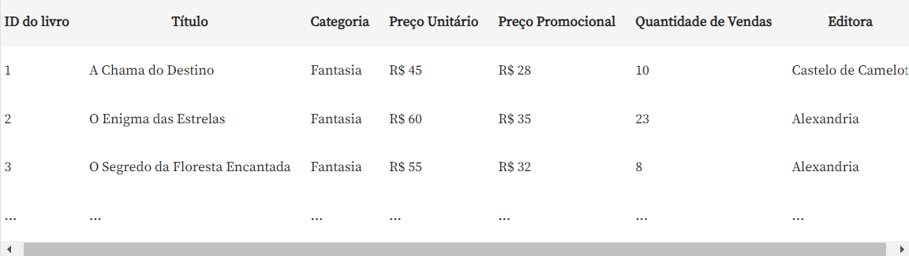
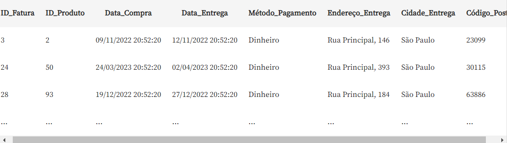

## Projeto feito por Leandro Launé

## Project Made by Leandro Launé

# Descrição do Projeto

# Project Description

**Portuguese Version:**

Neste projeto de Power BI, realizou-se uma análise do e-commerce de livros Buscante. Desenvolveu-se um projeto completo no Power BI Desktop, com cartões, gráficos de barras e colunas, além de segmentos de dados para filtros interativos. Utilizaram-se recursos visuais não nativos e gráficos de indicadores e linha. As análises de vendas e clientes foram consolidadas em um Dashboard navegável. Implementaram-se gráficos de mapas, abordando erros comuns e soluções. O resultado foi um Dashboard interativo e informativo.

**English Version:**

In this Power BI project, an analysis of the Buscante book e-commerce was carried out. A complete project was developed in Power BI Desktop, with cards, bar and column charts, as well as data segments for interactive filters. Non-native visual resources and indicator and line graphs were used. Sales and customer analyzes were consolidated into a navigable Dashboard. Map graphics were implemented, addressing common and solutions. The result was an interactive and informative Dashboard.

# 1.Funções Básicas da Tabela

# 1.Basic Table Functions

### Carregando os Dados e Criando Relacionamentos

### Loading Data and Creating Relationships

**Portuguese Version:**  
Primeiramente realizou-se o carregamento do dataset disponibilizado no arquivo entitulado "data" desse projeto.

Em seguida, criou-se a tabela "registros_livros_marketing" com dados provenientes do time de marketing e a tabela "registros_notas_logisticas", respectivamente presentes na imagem :

**English Version:**  
First, the dataset available in the file titled "data" of this project was loaded.

Next, the table "registros_livros_marketing" was created with data from the marketing team and the table "registros_notas_logisticas", respectively present in the image:




**Portuguese Version:**  
É importante ressaltar que Criou-se uma coluna calculada: “categoria do livro” utilizando dax com a vantagem da coluna não aparecer apenas para uma visualização, mas estar disponível para ser utilizada para criar métricas, medidas e colunas calculadas com os dados de logística. O código utilizado foi:
**English Version:**  
It is important to highlight that a calculated column was created: “book category” using dax with the advantage of the column not only appearing for a visualization, but being available to be used to create metrics, measures and columns calculated with the logistics data.The code used was:

```dax

Categoria do livro = RELATED(registros_livros_marketing[Categoria])
-- Buscando informação de categoria

```

**Portuguese Version:**  
Estabelecendo Relacionamento entre dados do time de logística e de marketing na exibição de modelo conforme a imagem:  
**English Version:**  
Establishing a relationship between data from the logistics and marketing team in the model display as shown in the image:  


**Portuguese Version:**  
Para reunir informações mais relevantes em relação à demanda de análises criou-se uma tabela com base no relacionamento pre-estabelecido:  
**English Version:**  
To gather more relevant information in relation to the demand for analysis, a table was created based on the pre-established relationship:  


### Aplicando Filtro e Combinando fontes de Dados

**Portuguese Version:**  
No projeto, foi realizada a combinação de duas fontes de dados distintas, essencial para unificar diferentes definições de métricas de "quantidade de produtos vendidos" dos times de marketing e logística. Criou-se uma visualização no Power BI para comparar essas métricas. Foram selecionados os campos "ID_Produto" e "ID_Fatura", configurando "ID_Fatura" para "Não resumir".

Criando uma coluna calculada "Quantidade vendida Logística" utilizando DAX , que filtra e conta registros de vendas de acordo com os critérios logísticos:

```

Quantidade vendida Logística =
VAR ID_ATUAL = 'registro_notas_logistica'[ID_Produto]
VAR TABELA_IDS = FILTER('registro_notas_logistica', 'registro_notas_logistica'[ID_Produto] = ID_ATUAL)
RETURN
    COUNTROWS(TABELA_IDS)

```

A visualização no Power BI comparou as quantidades registradas pelos dois times, confirmando a consistência dos dados, de acordo com a tabela obtida abaixo. Essa integração permite criar métricas mais precisas e orientadas para a análise de negócios.
  
**English Version:**  
In the project, two distinct data sources were combined, essential to unify different definitions of "quantity of products sold" metrics from the marketing and logistics teams. A visualization was created in Power BI to compare these metrics. The fields "Product_ID" and "Invoice_ID" were selected, setting "Invoice_ID" to "Do not summarize".

Creating a calculated column "Quantity sold Logistics" using DAX, which filters and counts sales records according to logistics criteria:

```

Quantity sold Logistics =
VAR CURRENT_ID = 'registro_notas_logistica'[Product_ID]
VAR TABELA_IDS = FILTER('registro_notas_logistica', 'registro_notas_logistica'[ID_Produto] = ID_CURRENT)
RETURN
    COUNTROWS(TABLE_IDS)

```

The visualization in Power BI compared the quantities recorded by the two teams, confirming the consistency of the data, according to the table obtained below. This integration allows you to create more accurate and business analysis-oriented metrics.  

