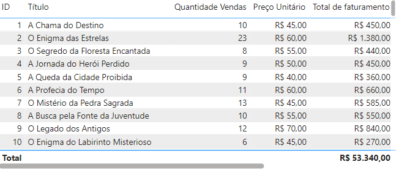
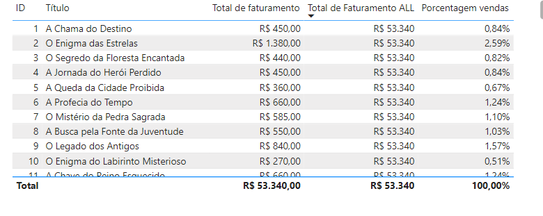
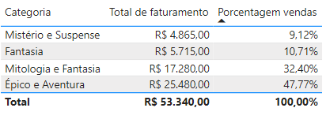
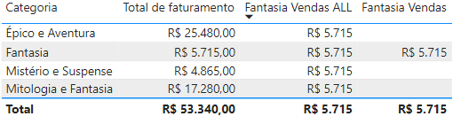

## Projeto feito por Leandro Launé

## Project Made by Leandro Launé

# Descrição do Projeto

# Project Description

**Portuguese Version:**

Neste projeto de Power BI, realizou-se uma análise do e-commerce de livros Buscante. Desenvolveu-se um projeto completo no Power BI Desktop, com cartões, gráficos de barras e colunas, além de segmentos de dados para filtros interativos. Utilizaram-se recursos visuais não nativos e gráficos de indicadores e linha. As análises de vendas e clientes foram consolidadas em um Dashboard navegável. Implementaram-se gráficos de mapas, abordando erros comuns e soluções. O resultado foi um Dashboard interativo e informativo.

**English Version:**

In this Power BI project, an analysis of the Buscante book e-commerce was carried out. A complete project was developed in Power BI Desktop, with cards, bar and column charts, as well as data segments for interactive filters. Non-native visual resources and indicator and line graphs were used. Sales and customer analyzes were consolidated into a navigable Dashboard. Map graphics were implemented, addressing common and solutions. The result was an interactive and informative Dashboard.

# 1.Funções Básicas da Tabela

# 1.Basic Table Functions

### Carregando os Dados e Criando Relacionamentos

### Loading Data and Creating Relationships

**Portuguese Version:**  
Primeiramente realizou-se o carregamento do dataset disponibilizado no arquivo entitulado "data" desse projeto.

Em seguida, criou-se a tabela "registros_livros_marketing" com dados provenientes do time de marketing e a tabela "registros_notas_logisticas", respectivamente presentes na imagem :

**English Version:**  
First, the dataset available in the file titled "data" of this project was loaded.

Next, the table "registros_livros_marketing" was created with data from the marketing team and the table "registros_notas_logisticas", respectively present in the image:


**Portuguese Version:**  
É importante ressaltar que Criou-se uma coluna calculada: “categoria do livro” utilizando dax com a vantagem da coluna não aparecer apenas para uma visualização, mas estar disponível para ser utilizada para criar métricas, medidas e colunas calculadas com os dados de logística. O código utilizado foi:  
**English Version:**  
It is important to highlight that a calculated column was created: “book category” using dax with the advantage of the column not only appearing for a visualization, but being available to be used to create metrics, measures and columns calculated with the logistics data.The code used was:

```dax

Categoria do livro = RELATED(registros_livros_marketing[Categoria])
-- Buscando informação de categoria

```

**Portuguese Version:**  
Estabelecendo Relacionamento entre dados do time de logística e de marketing na exibição de modelo conforme a imagem:  
**English Version:**  
Establishing a relationship between data from the logistics and marketing team in the model display as shown in the image:  


**Portuguese Version:**  
Para reunir informações mais relevantes em relação à demanda de análises criou-se uma tabela com base no relacionamento pre-estabelecido:  
**English Version:**  
To gather more relevant information in relation to the demand for analysis, a table was created based on the pre-established relationship:  


### Aplicando Filtro e Combinando fontes de Dados

### Applying Filter and Combining Data Sources

**Portuguese Version:**  
No projeto, foi realizada a combinação de duas fontes de dados distintas, essencial para unificar diferentes definições de métricas de "quantidade de produtos vendidos" dos times de marketing e logística. Criou-se uma visualização no Power BI para comparar essas métricas. Foram selecionados os campos "ID_Produto" e "ID_Fatura", configurando "ID_Fatura" para "Não resumir".

Criando uma coluna calculada "Quantidade vendida Logística" utilizando DAX , que filtra e conta registros de vendas de acordo com os critérios logísticos:

```

Quantidade vendida Logística =
VAR ID_ATUAL = 'registro_notas_logistica'[ID_Produto]
VAR TABELA_IDS = FILTER('registro_notas_logistica', 'registro_notas_logistica'[ID_Produto] = ID_ATUAL)
RETURN
    COUNTROWS(TABELA_IDS)

```

A visualização no Power BI comparou as quantidades registradas pelos dois times, confirmando a consistência dos dados, de acordo com a tabela obtida abaixo. Essa integração permite criar métricas mais precisas e orientadas para a análise de negócios.
  
**English Version:**  
In the project, two distinct data sources were combined, essential to unify different definitions of "quantity of products sold" metrics from the marketing and logistics teams. A visualization was created in Power BI to compare these metrics. The fields "Product_ID" and "Invoice_ID" were selected, setting "Invoice_ID" to "Do not summarize".

Creating a calculated column "Quantity sold Logistics" using DAX, which filters and counts sales records according to logistics criteria:

```

Quantity sold Logistics =
VAR CURRENT_ID = 'registro_notas_logistica'[Product_ID]
VAR TABELA_IDS = FILTER('registro_notas_logistica', 'registro_notas_logistica'[ID_Produto] = ID_CURRENT)
RETURN
    COUNTROWS(TABLE_IDS)

```

The visualization in Power BI compared the quantities recorded by the two teams, confirming the consistency of the data, according to the table obtained below. This integration allows you to create more accurate and business analysis-oriented metrics.  


# 2.Combinando Funções

# 2.Combining Functions

### Calculando o Total de Vendas com SUMX

### Calculating Total Sales with SUMX

**Portuguese Version:**  
No projeto, foi necessário criar medidas de valor para a liderança, como o total de faturamento.

Primeiro, uma nova página e tabela foram criadas no Power BI para visualizar o total de faturamento. As colunas "ID", "Título" e "Quantidade Vendas" da tabela registro_livros_marketing foram selecionadas.

Para calcular o total de faturamento, uma nova tabela chamada "Medidas" foi criada para armazenar as medidas. Em seguida, uma medida chamada "Total de faturamento" foi definida usando DAX:

```

Total de faturamento = SUMX('registro_livros_marketing', 'registro_livros_marketing'[Quantidade Vendas] \* 'registro_livros_marketing'[Preço Unitário])

```

A função SUMX foi utilizada para iterar sobre cada linha da tabela, multiplicando a quantidade de vendas pelo preço unitário e somando os resultados.

Após formatar o campo "Preço Unitário" como moeda e ajustar o formato da medida, a tabela resultante exibiu o total de faturamento para cada produto, além do total geral. Isso proporcionou uma visão clara do faturamento mensal.  
  
**English Version:**  
In the project, it was necessary to create value measures for leadership, such as total revenue.

First, a new page and table were created in Power BI to visualize total revenue. The "ID", "Title" and "Sales Quantity" columns from the Registro_livros_marketing table were selected.

To calculate the total billing, a new table called "Measurements" was created to store the measurements. Next, a measure called "Total Billings" was defined using DAX:

```

Total de faturamento = SUMX('registro_livros_marketing', 'registro_livros_marketing'[Quantidade Vendas] \* 'registro_livros_marketing'[Preço Unitário])

```

The SUMX function was used to iterate over each row in the table, multiplying the quantity of sales by the unit price and summing the results.

After formatting the "Unit Price" field as currency and adjusting the measurement format, the resulting table displayed the total revenue for each product, in addition to the grand total. This provided a clear view of monthly revenue.


### Calculando a porcentagem de vendas com ALL

### Calculating percentage of sales with ALL

**Portuguese Version:**  
Para analisar melhor o faturamento, calculou-se a porcentagem de vendas de cada livro. Para isso, foi criada uma medida DAX que ignora filtros de linha.

Primeiro, criou-se a medida "Total de Faturamento ALL":

```plaintext
Total de Faturamento ALL = SUMX(ALL('registro_livros_marketing'), 'registro_livros_marketing'[Quantidade Vendas] * 'registro_livros_marketing'[Preço Unitário])
```

Essa função `SUMX` calcula o total de faturamento sem considerar os filtros aplicados, utilizando `ALL` para incluir todos os dados da tabela.

Em seguida, criou-se a medida "Porcentagem vendas":

```plaintext
Porcentagem vendas = DIVIDE('Medidas'[Total de faturamento], 'Medidas'[Total de Faturamento ALL])
```

A função `DIVIDE` calcula a porcentagem dividindo o faturamento de cada livro pelo total de faturamento.

O resultado foi formatado como porcentagem, permitindo identificar a contribuição de cada livro para o faturamento total, essencial para análises de marketing e tomada de decisões baseadas em dados. A tabela resultante estará logo abaixo da versão em inglês.
**English Version:**  
To better analyze revenue, the percentage of sales of each book was calculated. To achieve this, a DAX measure was created that ignores line filters.

First, the "Total ALL Revenue" measure was created:

```plaintext
Total de Faturamento ALL = SUMX(ALL('registro_livros_marketing'), 'registro_livros_marketing'[Quantidade Vendas] * 'registro_livros_marketing'[Preço Unitário])
```

This `SUMX` function calculates the total billing without considering the applied filters, using `ALL` to include all data in the table.

Then, the “Sales Percentage” measure was created:

```plaintext
Porcentagem vendas = DIVIDE('Medidas'[Total de faturamento], 'Medidas'[Total de Faturamento ALL])
```

The `DIVIDE` function calculates the percentage by dividing the revenue of each book by the total revenue.

The result was formatted as a percentage, allowing the contribution of each book to total revenue to be identified, essential for marketing analysis and data-based decision making. Resulting Table:  


### Porcentagem de Vendas em Outro contexto

### Percentage of Sales in Another Context

**Portuguese Version:**  
Foi identificada a necessidade de agrupar as porcentagens de vendas para facilitar a análise.Primeiro, selecionou-se a coluna "Categoria" da tabela registro_livros_marketing para agrupar os livros, Depois, adicionaram-se as medidas "Total de faturamento" e "Porcentagem vendas". Essa nova abordagem agregou valor à análise, permitindo identificar quais categorias necessitam de mais investimento em marketing. A imagem da tabela resultante está abaixo da versão em inglês.  
**English Version:**  
The need to group sales percentages was identified to facilitate analysis. First, the "Category" column of the Registro_livros_marketing table was selected to group the books. Then, the "Total revenue" and "Sales percentage" measures were added. . This new approach added value to the analysis, allowing us to identify which categories require more investment in marketing. The resulting table image is below the English version.  


# 3.Utilizando Função Calculate

# 3.Using Calculate Function

### Criando Medida com Calculate

### Creating Measurement with Calculate

**Portuguese Version:**  
Com o intuito de calcular o faturamento total para uma categoria específica, no caso, a categoría de "fantasia", Foi usada a função CALCULATE em DAX. O processo começou com a criação de uma nova medida:

```
Fantasia Vendas =
CALCULATE('Medidas'[Total de faturamento],
FILTER(ALL('registro_livros_marketing'[Categoria]),
'registro_livros_marketing'[Categoria] = "Fantasia"))
```

A medida chamou a expressão de faturamento total e aplicou o filtro para considerar apenas a categoria "fantasia".

Também criou-se uma nova medida, removendo a função ALL:

```
Fantasia Vendas =
CALCULATE('Medidas'[Total de faturamento],
FILTER('registro_livros_marketing',
    'registro_livros_marketing'[Categoria] = "Fantasia"))
```

Essa medida respeita os filtros aplicados na visualização, mostrando o faturamento de "fantasia" apenas na linha correspondente. Isso evitou a duplicação de informações e tornou a visualização mais intuitiva. A tabela obtida foi a seguinte:  
  
**English Version:**  
In order to calculate the total revenue for a specific category, in this case, the "fantasy" category, the CALCULATE function in DAX was used. The process began with the creation of a new measure:

```
Fantasia Vendas =
CALCULATE('Medidas'[Total de faturamento],
FILTER(ALL('registro_livros_marketing'[Categoria]),
'registro_livros_marketing'[Categoria] = "Fantasia"))
```

The measure called the expression total revenue and applied the filter to consider only the “fantasy” category.

A new measure was also created, removing the ALL function:

```
Fantasia Vendas =
CALCULATE('Medidas'[Total de faturamento],
FILTER('registro_livros_marketing',
    'registro_livros_marketing'[Categoria] = "Fantasia"))
```

This measure respects the filters applied in the visualization, showing "fantasy" billing only in the corresponding line. This avoided duplication of information and made visualization more intuitive. The corresponding resulting table is just below the portuguese version.

### Calculate se Adaptando a Mudança de Contexto

### Calculate Adapting to Context Change

**Portuguese Version:**  
Para obter-se novos insights, foi criada uma nova tabela, exibindo o faturamento por editora. Na nova tabela, foram incluídas as colunas "Editora" e "Total de faturamento". Em seguida, adicionou-se a coluna "Fantasia Vendas" para mostrar o faturamento específico de livros de fantasia por editora:  
  
Essa nova visualização destacou que a editora Alexandria obteve R$2.820 em vendas de livros de fantasia, enquanto a editora Povo do Livro não teve vendas nessa categoria, proporcionando insights valiosos para a estratégia de negócios.  
**English Version:**  
publishing company. In the new table, the "Publisher" and "Total revenue" columns were included. Then, the "Fantasy Sales" column was added to show the specific revenue of fantasy books by publisher. The table resulting from this step is shown in the Portuguese version
This new visualization highlighted that publisher Alexandria had R$2,820 in fantasy book sales, while publisher Povo do Livro had no sales in this category, providing valuable insights for business strategy.
